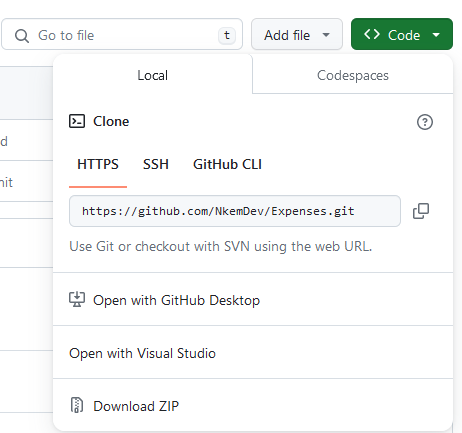

# Expense Model Project
## Project Description
This project is about expense software to manage financial expenses. It is written in Python programming language. The program consists of two classes Expense and ExpenseDB. The Expense class has five attributes
* **id** - This uniquely identifies every expense object and it is generated by the Universal Unique Identifier (UUID) module. A UUID is a 128-bit value used to uniquely identify an object or entity on the internet.
* **title**: A string representing the title of the expense.
* **amount**: A float representing the amount of the expense.
* **created_at**: A timestamp indicating when the expense was created (UTC).
* **updated_at**: A timestamp indicating the last time the expense was updated (UTC)
  
It has three methods 
* **__init__**: Initializes all the attributes (title, amount,created_at and updated_at).
  ```
  def __init__(self,title,amount):
        self.id =str(uuid.uuid4())
        self.title =title
        self.amount =amount
        self.created_at =datetime.utcnow()
        self.updated_at =self.created_at
  ```
* **update**: Allows updating the title and/or amount, updating the updated_at timestamp.
  ```
  def update(self, title=None,amount=None):
        if self.title is not None:
            self.title =title
        if self.amount is not None:
            self.amount = amount
        self.updated_at =datetime.utcnow()
        print(f'The Expense has been updated successfully')
  ```
* **to_dict**: Returns a dictionary representation of the expense.
  ```
  def to_dict(self):
        return {
            'id':self.id,
            'Title':self.title,
            'Amount':self.amount,
            'Created_at':self.created_at,
            'Updated_at':self.updated_at
        }
  ```
  
For the ExpenseDB class, consists of one attribute **expenses**, which is an empty list. The methods for this class are;
* **__init__**: To initialize the attribute. In this class, there is only one attribute which is the expenses attribute and it is an empty list.
  ```
  def __init__(self):
        self.expenses=[] #Creates a list
  ```
* **add_expense**: This method allows you to add an item to the list
  ```
  def add_expense(self,expense):
        #function to add expense into the database
        self.expenses.append(expense)
        print(f'{expense} added successfully')
  ```
* **remove_expense**: This method allows you to remove an expense from the list via the expense_id which uniquely identifies each expense item.
  ```
  def remove_expense(self,expense_id):
        #method to remove expense via its id
        self.expenses =[expense for expense in self.expenses if expense.id !=expense_id ]
        print(f'Expense with id:{expense_id}has been removed')
  ```
* **get_expense_by _id**: This method returns an expense after searching using its id
  ```
  def get_expense_by_id(self,expense_id):
        expense =[expense for expense in self.expenses if expense.id == expense_id]
        if len(expense)==0:
            return None
        return expense[0]
  ```
* **get_expense_by_title**: This method returns a list of expense items of the same title using the title as its search method.
  ```
  def get_expense_by_title(self,expense_title):
        return[expense for expense in self.expenses if expense.title ==expense_title]
  ```
* **to_dict**: This method returns a list of dictionaries representing each expense in the database.
  ```
  def to_dict(self):
        return [expense.to_dict() for expense in self.expenses]
  ```
## Cloning the Repository
There are two methods of cloning a repository
1. You can just go to my github [expenses](https://github.com/NkemDev/Expenses) repository and click on code green buttton and then download it as a zip file



2.  * Open gitbash on your computer.
    * Change the current working directory to the location where you want the cloned directory.
    * Type `git clone`, and then paste the URL you copied earlier.
    `$ git clone https://github.com/NkemDev/Expenses` and then press enter.

## How the code runs
To run the program

#### You create expense objects of the Expense class

```
expense_1 =Expense("Keyboard",5000.65)
expense_3 =Expense("Monitors",9880.87)
expense_2 =Expense('Stationary',1500.89)

```
#### Create a variable name edb for the ExpenseDB class

`edb =ExpenseDatabase()`

##### Adding the items into the database

```
edb.add_expense(expense_1)
edb.add_expense(expense_3)
edb.add_expense(expense_2)
```

Running it in the terminal, you type py -3 expense_model.py and press enter
This is the result
```
Keyboard 5000.65 added successfully
Monitors 9880.87 added successfully
Stationary 1500.89 added successfully
```
#### Updating items into the database
`edb.expenses[0].update(title ='Chairs',amount=15000.00)`

Typing py -3 expense_model.py on the terminal and then pressing enter to run the code, the result is this
`The Expense has been updated successfully`
### Checking the status of the updated database in the database
```
for expense in edb.expenses:
    print(expense.to_dict())

```
The result would be this

```
{'id': '2b343861-513b-49d8-8203-42fb5b469f81', 'Title': 'Chairs', 'Amount': 15000.0, 'Created_at': datetime.datetime(2023, 
12, 24, 17, 32, 24, 93137), 'Updated_at': datetime.datetime(2023, 12, 24, 17, 32, 24, 93137)}
{'id': 'bcb5655a-dd62-4ca5-aa9b-c8f36a00660e', 'Title': 'Monitors', 'Amount': 9880.87, 'Created_at': datetime.datetime(2023, 12, 24, 17, 32, 24, 93137), 'Updated_at': datetime.datetime(2023, 12, 24, 17, 32, 24, 93137)}
{'id': 'b59d9e95-2486-477a-929e-c31e0b0de2eb', 'Title': 'Stationary', 'Amount': 1500.89, 'Created_at': datetime.datetime(2023, 12, 24, 17, 32, 24, 93137), 'Updated_at': datetime.datetime(2023, 12, 24, 17, 32, 24, 93137)}
```
#### Get expense by id
`print(edb.get_expense_by_id('0d6da2b6-06dc-420d-8b49-18c0642fb517'))`

The result in the terminal
```
None
```
#### Get expense by title
'print(edb.get_expense_by_title("Monitors"))`
Running it on the terminal, the result is 

`[Monitors 9880.87]`
#### Removing an expense object
```
print("\nRemove an Expense")
edb.remove_expense(expense_3.id)
```
Running it in the terminal the result is

```
Remove an Expense
Expense with id:bcb5655a-dd62-4ca5-aa9b-c8f36a00660ehas been removed
```
#### Checking the status of the database
```print('Check status of database')
for expense in edb.expenses:
    print(expense.to_dict())
```
The result is

```
Check status of database
{'id': '2b343861-513b-49d8-8203-42fb5b469f81', 'Title': 'Chairs', 'Amount': 15000.0, 'Created_at': datetime.datetime(2023, 
12, 24, 17, 32, 24, 93137), 'Updated_at': datetime.datetime(2023, 12, 24, 17, 32, 24, 93137)}
{'id': 'b59d9e95-2486-477a-929e-c31e0b0de2eb', 'Title': 'Stationary', 'Amount': 1500.89, 'Created_at': datetime.datetime(2023, 12, 24, 17, 32, 24, 93137), 'Updated_at': datetime.datetime(2023, 12, 24, 17, 32, 24, 93137)}
```


